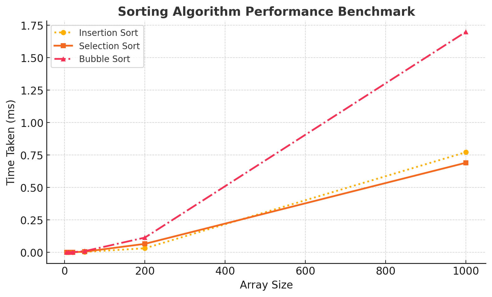

# Hands-On-2
## Implementation
This directory holds the source code in the src directory and array information in the array_data directory.

### To compile:
```
make
```
### To Run:
```
./sorting_benchmark
```

## Selection Sort Correctness
Note: using 0-based indexing, and the entire array is notated as `array[0...n-1]`, where `n` is the size of `array`

```cpp
void selection_sort(int array[], int size) {
    int i = 0;                                 // 1
    int j = 0;                                 // 2
    for(i = 0; i < size-1; i++) {              // 3
        int min_idx = i;                       // 4
        for(j = i+1; j < size; j++) {          // 5
            if(array[j] < array[min_idx]) {    // 6
                min_idx = j;                   // 7
            }                                  // 8
        }                                      // 9
        if(min_idx != i) {                     // 10
            SWAP(array[i], array[min_idx]);    // 11
        }                                      // 12
    }                                          // 13
}
```
### Loop Invariant
At the start of each iteration of the outermost for loop, the subarray `array[0...i-1]` is sorted. In addition, all elements in the sorted subarray (`array[0...i-1]`) are all smaller than or equal to the elements in the unsorted subarray (`array[i...n-1]`).

### Initialization
When i = 0, then the sorted subarray in question is `array[0...-1]`, which has zero elements. As a result, this subarray is trivially sorted. Since the sorted subarray has no elements, there is nothing to compare to with the unsorted subarray. As such, the second part of the loop invariant is trivially satisfied.

### Maintenance
Lines 4-9 are used to identify the smallest element in the unsorted portion of the array (`array[i..n-1]`). Once the smallest element is found, it is then swapped with the element at `array[i]` (lines 10-12). After the swap, the value of `i` increases.

At this point, there is an additional element in the sorted subarray. Since the inner loop (lines 4-9) picked the smallest element from the unsorted portion, the swap exchanged an unsorted element for the smallest element in the unsorted array. This guarantees that the elements in the sorted subarray are smaller than or equal to the elements in the unsorted subarray. This also maintans the property that all elements from `array[0...i-1]` are sorted, as the first element in the sorted section will be the smallest value, and the next will be larger than the first, but smaller than or equal to the rest. This then continues on as the value of `i` increases.

### Termination
At the end of the loop, the value of `i` will be equal to `n-1` since the loop condition is `i < n-1`. The loop invariant guarantees that the subarray `array[0...i-1]` is sorted, which means that the subarray `array[0...n-2]` is sorted. This also means that the elements in `array[0...n-2]` are all smaller than or equal to the elements in `array[n-1...n-1]`. Since the subarray of the unsorted elements is only 1 element and the entire array is just `array[0...n-1]`, then appending the 1 element from the unsorted subarray to the sorted subarray will result a sorted array containing all elements of the original array. Thus, the original input array is sorted.

## Algorithm Comparison
### Specs
* Processor: 12th Gen Intel(R) Core(TM) i7-12650H   2.30 GHz
* RAM: 32.0 GB
* OS: Ubuntu 22.04.3 LTS via WSL2 on Windows 11
* Compiler: g++ (Ubuntu 11.4.0-1ubuntu1~22.04) 11.4.0

